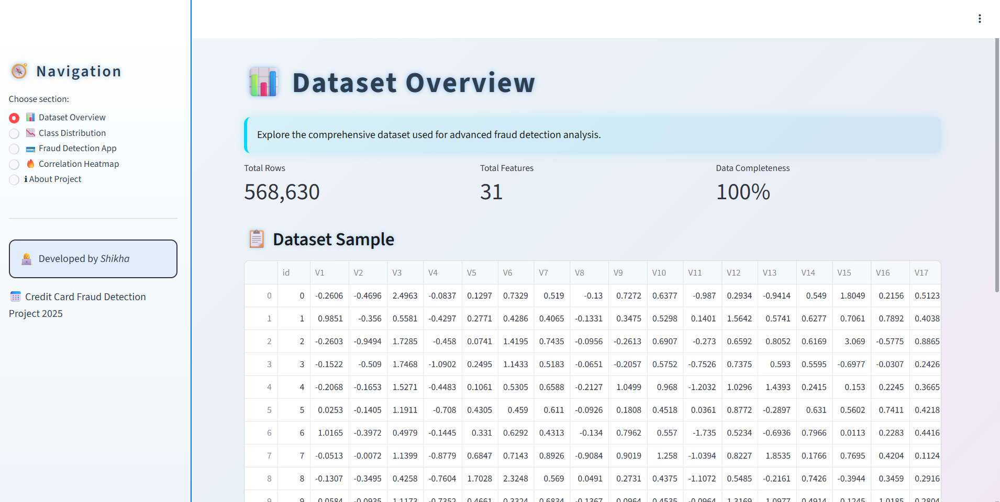
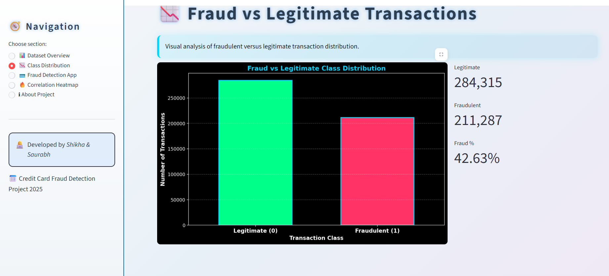

# 💳 Credit Card Fraud Detection System

> A production-ready ML system to detect fraudulent credit card 
> transactions in real-time, complete with an interactive 
> Streamlit dashboard.

---

## 🚀 Live Demo
Built and deployed via Streamlit + ngrok on Google Colab

---

## 📌 Problem Statement
Credit card fraud is a major challenge in financial systems.
This project tackles the core challenge of **highly imbalanced 
data** (originally only 148 fraud vs 49,456 legit transactions) 
and builds a real-time fraud detection system.

---

## 📊 Dataset
- Source: Kaggle (creditcard_2023.csv)
- Total Records: 49,605 transactions
- Features: 28 PCA-transformed features (V1-V28) + Amount
- Target: Class (0 = Legitimate, 1 = Fraudulent)
- Challenge: Highly imbalanced (only 0.3% fraud cases)

---

## ⚙️ Methodology
1. **EDA** — Statistical analysis, correlation heatmap, 
   class distribution visualization
2. **Preprocessing** — StandardScaler, SimpleImputer, 
   stratified train-test split (80-20)
3. **Class Balancing** — Oversampling to achieve 
   42.63% fraud ratio (284,315 legit vs 211,287 fraud)
4. **Model Training** — Logistic Regression vs Random Forest
5. **Evaluation** — Confusion Matrix + Classification Report
6. **Deployment** — Streamlit dashboard + ngrok

---

## 🤖 Models & Results

| Model | Accuracy | F1-Score (Fraud) |
|-------|----------|-----------------|
| Logistic Regression | 99.82% | 0.72 |
| **Random Forest** ✅ | **99.92%** | **0.88** |

> Random Forest selected as final model — saved as 
> `fraud_detection_model.pkl`

---

## 🖥️ Streamlit Dashboard Features
- 📊 Dataset Overview
- 📈 Fraud vs Legitimate Class Distribution
- 🔥 Correlation Heatmap
- 🔍 Real-time Fraud Detection App
- 🔒 Privacy-first — No data logging

---
## 🖥️ Dashboard Screenshots

### Dataset Overview

### Class Distribution

## 🛠️ Tech Stack
| Category | Tools |
|----------|-------|
| Language | Python |
| ML Models | Scikit-learn |
| Data | Pandas, NumPy |
| Visualization | Matplotlib, Seaborn |
| Dashboard | Streamlit |
| Deployment | ngrok, Google Colab |
| Model Saving | Joblib (.pkl) |

---

## 👩‍💻 Developed By
**Shikha Sahu **
 MMMUT Gorakhpur | 2025
